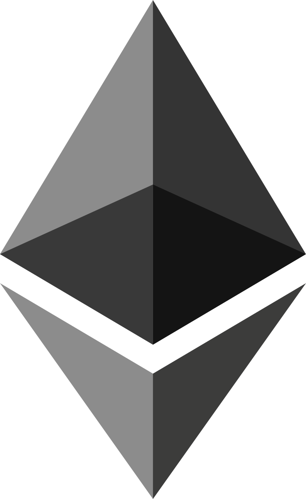

# Smart Contract Dev Portfolio
Smart contract developer portfolio by [@hieutrinh02](https://github.com/hieutrinh02).

This repository showcases the personal smart contract projects I've built as part of my development as a smart contract developer.

---

##  EVM Projects

| Category | Project | Repository | Last update | Version | Status |
|:---------|:--------|:------------|:---------|:---------|:---------|
| DeFi | CLMM | evm-clmm | | | Planned |

##  Starknet Projects

| Category | Project | Repository | Last update | Version | Status |
|:---------|:--------|:------------|:---------|:---------|:---------|
| DeFi | Lending | [starknet-lending](https://github.com/hieutrinh02/starknet-lending) | 2025-12 | v0.1.0 | ✅ Done |

##  Solana Projects

| Category | Project | Repository | Stack | Last update | Version | Status |
|:---------|:--------|:------------|:---------|:---------|:---------|:---------|
| NFT | NFT Marketplace | [solana-nft-marketplace-program](https://github.com/hieutrinh02/solana-nft-marketplace-program) [solana-nft-marketplace-indexer](https://github.com/hieutrinh02/solana-nft-marketplace-indexer) [solana-nft-marketplace-fe](https://github.com/hieutrinh02/solana-nft-marketplace-fe) | Anchor | 2026-04 | v0.2.0 | ✅ Done |
| DeFi | CPMM | [solana-cpmm-program](https://github.com/hieutrinh02/solana-cpmm-program) [solana-cpmm-indexer](https://github.com/hieutrinh02/solana-cpmm-indexer) [solana-cpmm-fe](https://github.com/hieutrinh02/solana-cpmm-fe) | Native | 2026-03 | v0.1.0 | ✅ Done |
